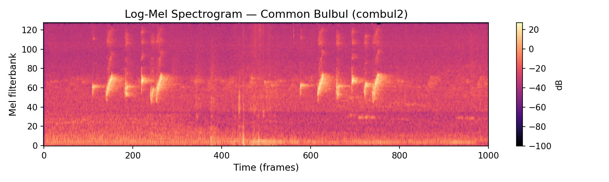

# Epoch 7 Engineering Competition Onboarding

This onboarding teaches fundamentals of competing in ML competitions through a mock Kaggle-style competition. Each session focuses on one pillar of an ML competition workflow. By the end you will have been acquainted with several important lessons and familiarized yourself with the techstack. 

---

## The Mock Competition

We are working with a subset of a dataset focused on identifying bird species from passive acoustic recordings in Africa. The full dataset covers 264 species; we have filtered it down to the **top 30 most-recorded species on the African subcontinent**, giving us ~4,200 recordings across 30 classes.

Each recording is a variable-length `.ogg` file (median ~30s) captured in the field by citizen scientists. The task is to classify the **primary species** present in a recording. You will train a model and submit predictions to the leaderboard — the evaluation metric is **mAP** (see Session 1 below).

### Submitting to the leaderboard

Once you have trained a model and generated predictions, run:

```bash
uv run submit.py
```

Before submitting, open `submit.py` and fill in your **team name** at the top of the file — this is how you will appear on the leaderboard.

There are no submission limits, so submit as often as you like. The leaderboard always shows your **best score** across all submissions, so there is no risk in submitting intermediate or experimental results.

### Starter pipeline

To let you focus on the concepts rather than boilerplate, a basic pipeline has already been set up:

| File | Purpose |
|---|---|
| `precompute_spectrograms.py` | Converts all audio files to log-mel spectrograms and caches them as `.pt` files — run this once before training |
| `prepare_dataset.py` | PyTorch `Dataset` that loads cached spectrograms and returns `(spec, label)` pairs |
| `metric.py` | mAP implementation using sklearn |
| `train.py` | Basic training loop with EfficientNet-B1 from timm |

The audio-to-spectrogram conversion is already handled for you. For a bird classification task this is a natural choice: bird calls have distinctive frequency patterns that are clearly visible in the spectrogram, and it lets us treat the problem as standard image classification — plugging in any pretrained CNN backbone off the shelf.

### From audio to model input — the Log-Mel Spectrogram

Neural networks cannot consume raw waveforms directly in most practical pipelines. Instead we convert audio into an image-like representation: the **log-mel spectrogram**.

1. Compute the Short-Time Fourier Transform (STFT) to get frequency content over time
2. Map the frequency axis onto the **mel scale** — a perceptual scale that mirrors how ears work, compressing high frequencies
3. Take the **log** of the power, converting to decibels — this compresses the dynamic range and makes the representation more linearly separable

The result is a 2D array (mel bins × time frames) that we treat as a single-channel image and feed into a standard image classifier.



*Each vertical slice is one 10ms window of audio. Brighter = more energy at that frequency at that moment. The repeated chirp pattern is the Common Bulbul's call.*

---

## Session 1 — Foundations & Validation

> **Goal:** Build the habit of trusting your feedback loop before anything else. A CV score you can rely on is worth more than any model improvement in the first weeks of a competition. If your metric is lying to you, every local improvement is untrustworthy.

---

## Environment setup with `uv`

### Why a virtual environment?

Every project needs its own isolated set of dependencies. Without one, installing package A for project 1 can silently break project 2 when A gets upgraded. A virtual environment (`.venv`) is a self-contained Python installation scoped to this project.

### Why `uv`?

`uv` is a Python package manager written in Rust. It is a drop-in replacement for `pip` + `venv` that is 10–100× faster and handles everything in one tool: creating environments, resolving dependencies, locking versions, and running scripts.

```bash
# install a package and add it to pyproject.toml
uv add torch torchaudio timm scikit-learn

# recreate the exact environment from the lockfile (e.g. after cloning the repo)
uv sync

# run a script inside the managed environment
uv run train.py
```

`uv sync` is the command you run after cloning — it reads `uv.lock` and installs the exact pinned versions everyone else on the project is using.

---

## The metric — mean Average Precision (mAP)
In each competition, it is crucial to properly understand the metric, since that is what you are spending your time optimizing.

In this competition the metric is mAP: mAP measures how well your model **ranks** the correct class. For each class, Average Precision (AP) summarises the precision-recall curve. It rewards a model that puts the right answer near the top of its confidence scores, not just above a threshold. mAP is the mean of AP across all 30 classes.

```python
from sklearn.metrics import average_precision_score

# targets: (N, 30) binary matrix
# preds:   (N, 30) probability matrix (sigmoid outputs, NOT logits)
map_score = average_precision_score(targets, preds, average="macro")
```

Key properties to understand:
- It is **threshold-free** — you are optimising a ranking, not a binary decision
- It is **macro-averaged** — a rare class counts as much as a common one, so class imbalance hurts you directly
- A model that outputs `0.5` for every class scores near zero; the signal is in relative ordering

---

## Cross-validation and OOF splits

You have a limited number of daily leaderboard submissions, so you cannot rely on the public leaderboard to evaluate every change you make. Instead, you reserve part of your own training data as a **validation set** and evaluate locally — this is your primary feedback signal.

The simplest approach is a single **hold-out split**: keep 80% for training, 20% for validation. It works, but it is noisy — your score depends heavily on which 20% you happened to hold out. A better approach is **k-fold cross-validation**: split the data into k equal folds, train k models each leaving out a different fold, and aggregate the results. A larger k gives a less noisy estimate of generalisation, at the cost of k times the compute.

### Not all splits are created equal

The goal of your validation set is to mock the hidden test set as closely as possible. If information leaks from your training set into your validation set, your local score will be artificially inflated — and you will only discover this when your leaderboard score is much lower than expected.

Before writing any split code, look carefully at the metadata: who collected these recordings, where, and how? Ask yourself what the test set likely looks like compared to the training set, and whether a naive random split would respect that boundary. Think about what the atomic unit of your split should be — is it a single 5-second clip, a full recording, or something else?

Getting this right is the most important engineering decision in Session 1. A fast model with a trustworthy CV beats a slow model you cannot evaluate.

### Save your OOF predictions

With k-fold CV, each model predicts on its held-out fold — the samples it never trained on. Concatenating these predictions across all folds gives you one prediction per training example, collectively called **out-of-fold (OOF) predictions**. Save them to disk after every experiment.

There are three reasons this matters:

1. **A single honest score.** Computing mAP on the full OOF array is more reliable than averaging the per-fold scores, because it weights each sample equally rather than each fold equally.
2. **A paper trail.** As you iterate, saved OOF files let you go back and understand what earlier models got right or wrong — even after you have stopped tracking that experiment.
3. **Free ensembling.** When you want to blend multiple models later, you already have their predictions on the full training set ready to combine without rerunning anything.

---

## Session 2 — Config Management & Experiment Tracking

> **Goal:** Make your experiments reproducible, organised, and comparable. By the end of this session every run will be fully configured from a single file, outputs will be organized and metrics will be logged automatically.

---

## Config management with Hydra

As soon as you start iterating, e.g. trying a different learning rate, swapping the model, a new strategy, hardcoded constants at the top of `train.py` become a problem. You end up editing source code to run experiments, which makes it hard to reproduce a previous run or track what you actually changed. In addition the constants are everywhere and get lost.

**Hydra** solves this by making your config file the single source of truth. All hyperparameters live in `configs/default.yaml`, and `train.py` receives them as a typed config object at runtime. You never touch `train.py` to change a parameter. Hydra does a lot of the boiler plate code for you.

```yaml
# configs/default.yaml
training:
  epochs: 10
  batch_size: 16
  lr: 1e-4  
```

```python
@hydra.main(config_path="configs", config_name="default", version_base=None)
def main(cfg: DictConfig):
    optimizer = torch.optim.AdamW(model.parameters(), lr=cfg.training.lr)
```

The real power comes from **command-line overrides** — you can change any value without editing a file:

```bash
# change learning rate for one run
uv run train.py training.lr=3e-4

# swap the model entirely
uv run train.py model.name=efficientnet_b0

# run a quick sweep over learning rates
uv run train.py --multirun training.lr=1e-3,1e-4,1e-5
```

Hydra also automatically saves a timestamped copy of the exact config used for each run under `outputs/`, which is very usefull for experiment tracking, and being able to reproduce things.

---

## Experiment tracking with Weights & Biases

In the previous session, we were logging training dynamics to the terminal by using `print` statements. However, we want to keep track of this information to reference it. 

**Weights & Biases (wandb)** logs every metric from every run to a persistent dashboard. Each run gets a name, a config snapshot, and a full history of every value you logged.

```python
import wandb

wandb.init(project="birdclef-africa", config=dict(cfg))

# inside the training loop
wandb.log({"epoch": epoch, "train_loss": train_loss, "val_loss": val_loss, "mAP": map_score})

wandb.finish()
```

This gives you the ability to do a lot of custom plotting, for instance:
- **Live loss curves** while training
- **Run comparison** — plot mAP vs epoch across every experiment on the same axes
- **Config diff** — see exactly what changed between any two runs

Before running, log in once:

```bash
wandb login
```

Then train as normal by running `uv run train.py`. A link to your run's dashboard will appear in the terminal output.

Wandb can be disabled for a run without changing any code:

```bash
uv run train.py wandb.enabled=false
```

---

## GPU Utilisation

> **Goal:** Make the GPU the bottleneck. If your GPU is sitting at 40% utilisation while your CPUs are maxed out, you are leaving most of your hardware idle. A properly saturated GPU trains 5–10× faster, and in a competition, that means 5–10× more experiments in the same time.

---

### Monitor first, optimise second

Before changing anything, measure. Two tools:

```bash
nvidia-smi        # snapshot of GPU utilisation, memory, and running processes (by NVIDIA)
nvtop             # live GPU monitor — like htop but for GPUs, much nicer (3rd party)
```

Watch GPU utilisation (%) while training. If it is consistently below ~90%, something upstream (e.g. data loading, CPU preprocessing or others) is the bottleneck, not the model. Your job is to find and fix that constraint. There are many levers to pull: number of dataloader workers, prefetching, pinned memory, batch size, precomputation. The challenge is yours to figure out.

### Use every GPU you have

During a long sweep or final training run, there is no reason to leave GPUs idle. First, check what you have:

```bash
nvidia-smi -L
```

Each device gets an index: `0`, `1`, `2`, ... You can target a specific one with the `CUDA_VISIBLE_DEVICES` environment variable:

```bash
# terminal 1 — runs on GPU 0
CUDA_VISIBLE_DEVICES=0 uv run train.py model.name=efficientnet_b0

# terminal 2 — runs on GPU 1
CUDA_VISIBLE_DEVICES=1 uv run train.py model.name=efficientnet_b1
```

This lets you run independent experiments in parallel across GPUs. Use one terminal per device (GPU). Combined with sweeping libraries and wandb logging, this is how you run a proper sweep without a cluster.
